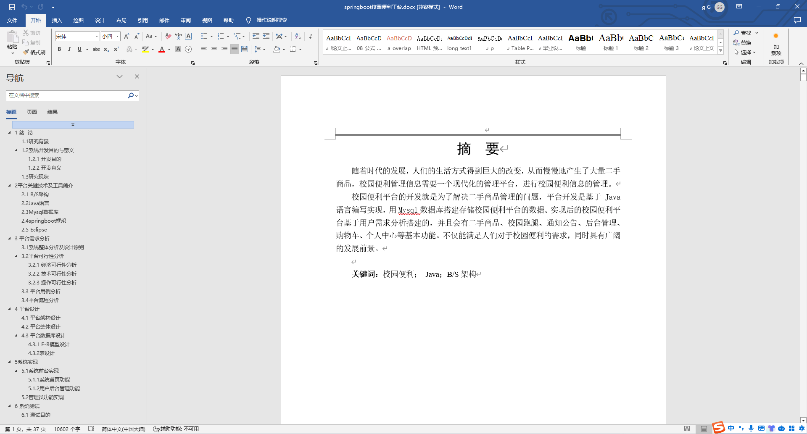
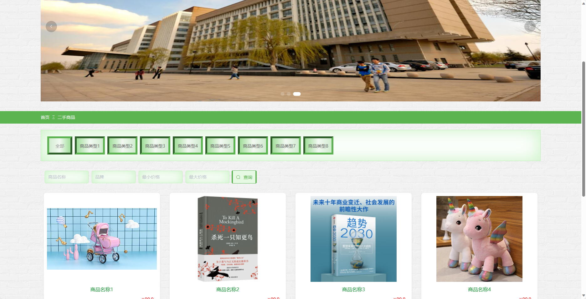
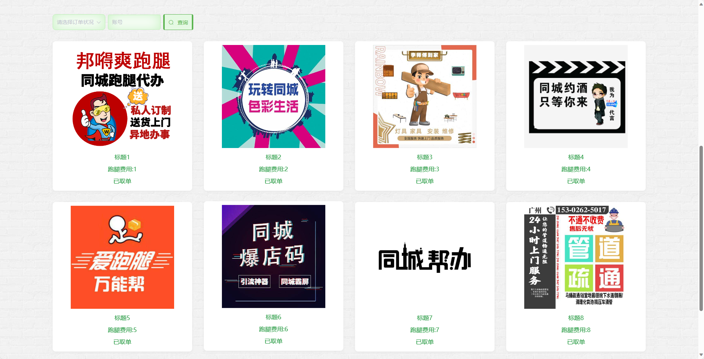
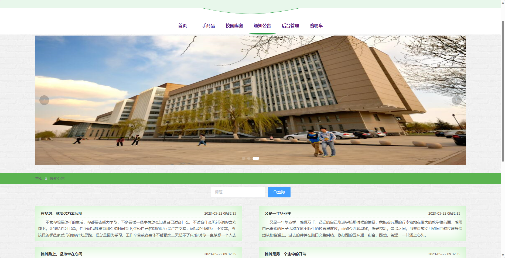
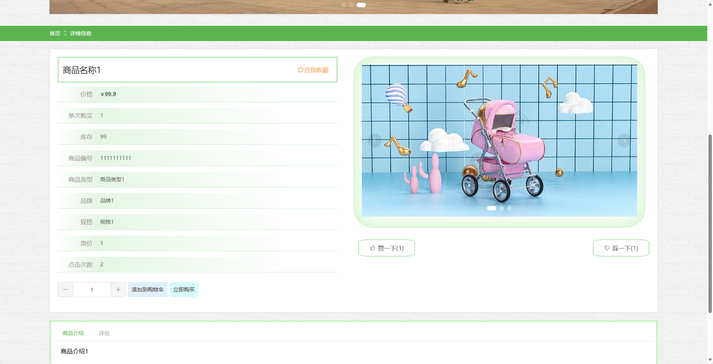
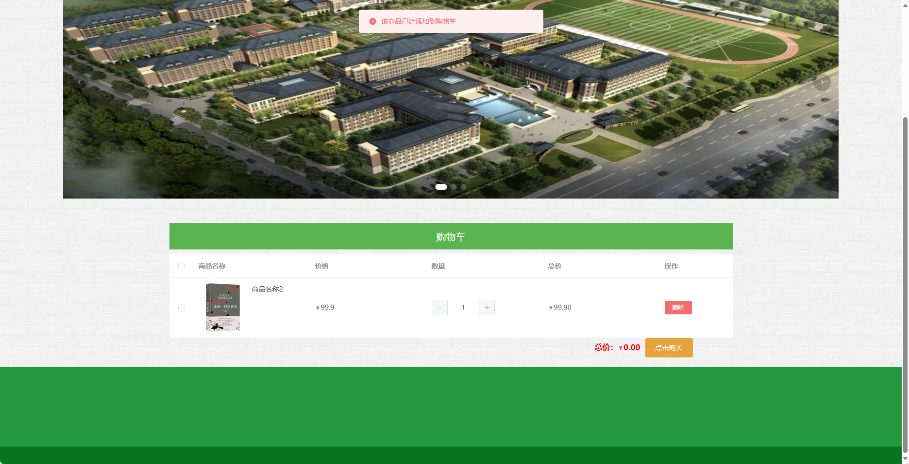
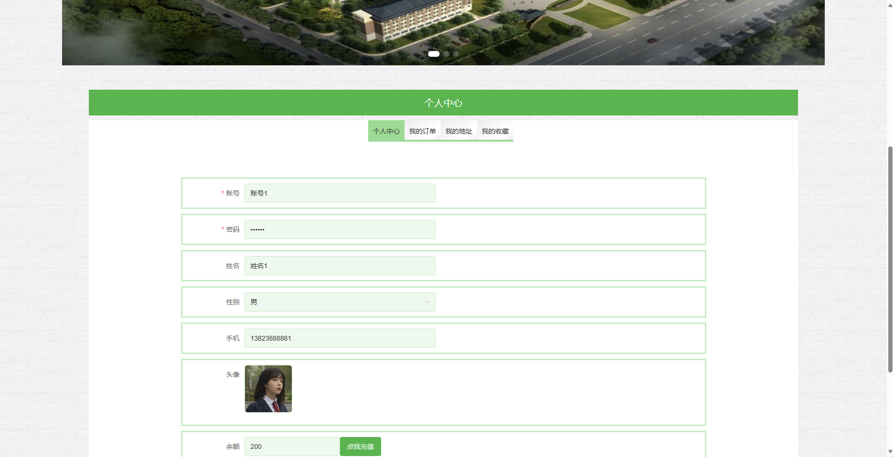
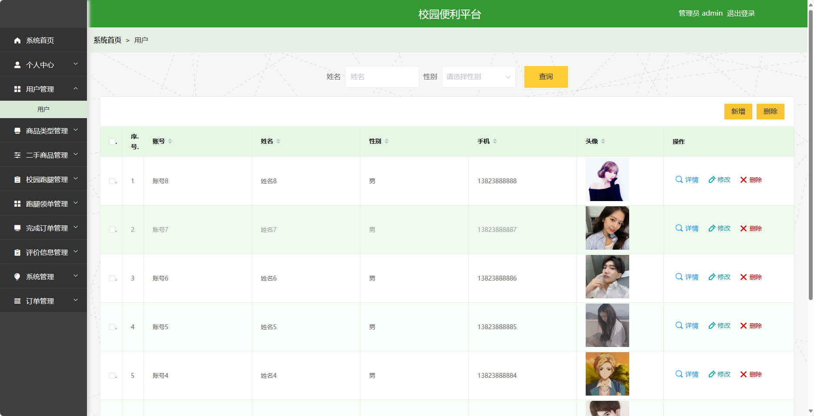
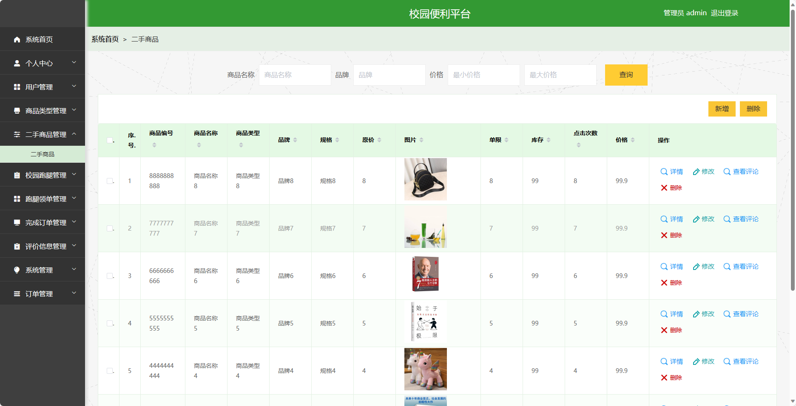
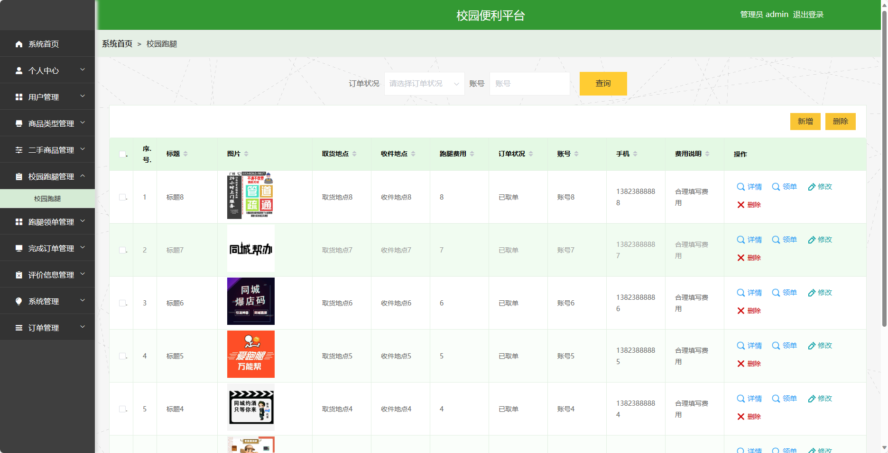

## 基于SpringBoot的校园便利平台(程序+报告)

- <b>完整代码获取地址：从戎源码网 ([https://armycodes.com/](https://armycodes.com/))</b>
- <b>技术探讨、资料分享，请加QQ群：692619798</b> 
- <b>作者微信：19941326836  QQ：952045282</b> 
- <b>承接计算机毕业设计、Java毕业设计、Python毕业设计、深度学习、机器学习</b>
- <b>选题+开题报告+任务书+程序定制+安装调试+论文+答辩ppt 一条龙服务</b>
- <b>所有选题地址 ([https://github.com/YuLin-Coder/AllProjectCatalog](https://github.com/YuLin-Coder/AllProjectCatalog)) </b>

## 项目介绍
基于SpringBoot的校园便利平台，系统包含两种角色：管理员、用户,系统分为前台和后台两大模块，主要功能如下。

### 【管理员】:
- 个人中心：管理员可以管理个人信息，修改密码等。
- 用户管理：管理员可以对用户信息进行增删改查等操作，包括用户姓名、联系方式等。
- 商品类型管理：管理员可以管理商品的分类信息，包括添加、编辑和删除商品分类。
- 二手商品管理：管理员可以管理二手商品信息，包括审核发布的商品、下架商品等。
- 校园跑腿管理：管理员可以管理跑腿任务的发布和状态变更，包括审核发布的任务、撤销任务等。
- 跑腿领单管理：管理员可以管理跑腿任务的接单情况，包括分配和取消任务。
- 完成订单管理：管理员可以管理跑腿任务的完成情况，包括确认交付和标记完成等。
- 评价信息管理：管理员可以管理用户对二手商品和校园跑腿的评价信息，包括查看和删除评价。
- 系统管理：管理员可以设置平台的基本信息，包括站点名称、联系方式等。
- 订单管理：管理员可以查看和管理用户购物车中的订单信息，包括订单状态的变更等。

### 【前台】:
- 首页：展示平台的概述信息、推荐商品等内容。
- 二手商品：用户可以查看、搜索和购买其他用户发布的二手商品。
- 校园跑腿：用户可以发布跑腿任务或接受他人发布的跑腿任务。
- 通知公告：平台管理员可以发布通知公告。
- 购物车：用户可以将感兴趣的商品添加到购物车。

## 项目技术
- 编程语言：Java
- 数据库：MySQL
- 项目管理工具：Maven
- 前端技术：HTML、CSS、JavaScript、Jquery、Vue
- 后端技术：Spring、SpringMVC、MyBatis

## 运行环境
- JDK版本：JDK1.8及以上
- 开发工具：IDEA、Ecplise、Myecplise都可以
- 数据库: MySQL5.7及以上
- Maven：maven3.0及以上
- Node：14.14.0及以上

## 运行截图

